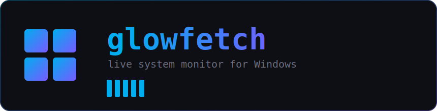
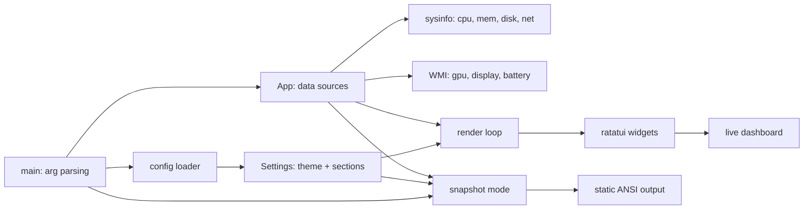
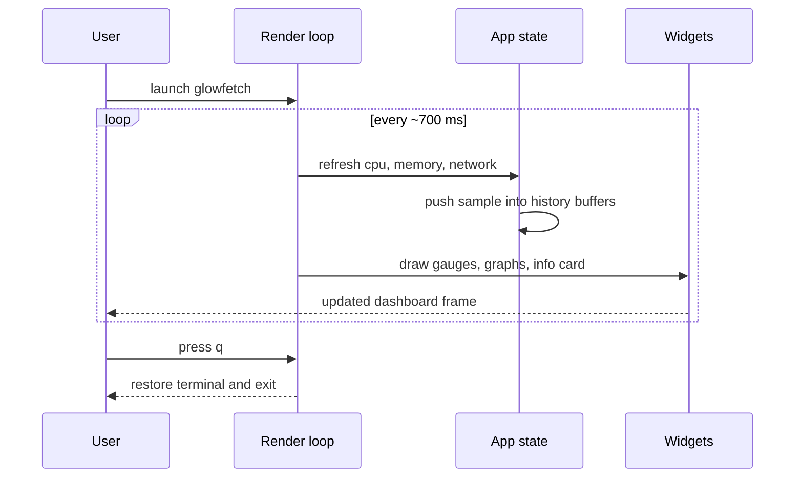
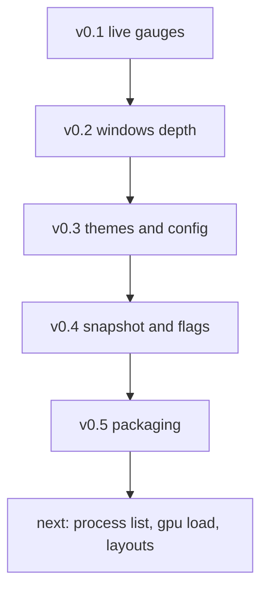
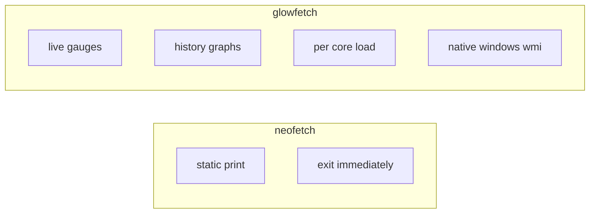

<p align="center">
  
</p>

<p align="center">
  <a href="https://github.com/Nuu-maan/glowfetch/actions"></a>
  <a href="https://crates.io/crates/glowfetch"></a>
  <a href="https://github.com/microsoft/winget-pkgs"></a>
  
  <a href="LICENSE"></a>
</p>

<p align="center">
  <b>A live, animated system monitor for the Windows terminal.</b><br>
  Think of neofetch, but the gauges actually move.
</p>

---

## Overview

glowfetch is a terminal user interface that reports your system at a glance and keeps updating in real time. Where classic fetch tools print a static block and exit, glowfetch opens a compact dashboard with live CPU, memory, disk, and network meters, a per core load row, and rolling history graphs. It is written in Rust, ships as a single executable of roughly half a megabyte, and requires no runtime.

It is built for Windows first. Hardware details are read through WMI, so the graphics card, display resolution, and battery are detected natively.

## Features

- Live dashboard with CPU, RAM, and disk gauges that recolor by load.
- Per core load row and rolling history graphs for CPU and network.
- Native Windows hardware detail through WMI: GPU, resolution, and battery.
- Live network throughput, both download and upload.
- Five built in themes plus full color overrides through a config file.
- Section toggles, so you show only the panels you care about.
- A static snapshot mode for screenshots, in the spirit of neofetch.
- Glyph safe by default, with optional fancy icons when a capable terminal is detected.

## Quick start

```powershell
# build from source
git clone https://github.com/Nuu-maan/glowfetch.git
cd glowfetch
cargo build --release

# run the live dashboard
.\target\release\glowfetch.exe

# print a static snapshot and exit
.\target\release\glowfetch.exe --once
```

Press `q` or `Esc` to quit the live view.

## Installation

Pick whichever package manager you already use. All methods install the same single executable.

| Method | Command |
| --- | --- |
| Cargo | `cargo install glowfetch` |
| winget | `winget install NuuMaan.Glowfetch` |
| Scoop | `scoop install https://raw.githubusercontent.com/Nuu-maan/glowfetch/main/packaging/scoop/glowfetch.json` |
| Release | Download the zip from the [latest release](https://github.com/Nuu-maan/glowfetch/releases/latest) |

### Cargo

```powershell
cargo install glowfetch
```

### winget

```powershell
winget install NuuMaan.Glowfetch
```

If the package is still in review on the community repository, install from the manifest in this repository:

```powershell
winget install --manifest packaging/winget/manifests/n/NuuMaan/Glowfetch/0.1.0
```

### Scoop

```powershell
scoop install https://raw.githubusercontent.com/Nuu-maan/glowfetch/main/packaging/scoop/glowfetch.json
```

## Architecture



## Data flow



## Usage

```text
USAGE:
    glowfetch [OPTIONS]

OPTIONS:
    -o, --once          Print a static snapshot and exit
    -t, --theme <NAME>  windows | matrix | dracula | nord | amber
        --config <PATH> Use a specific config file
        --gen-config    Write a sample config and exit
        --fancy         Force fancy glyphs on
        --no-fancy      Force fancy glyphs off
        --no-logo       Hide the ASCII logo
    -h, --help          Show this help
    -V, --version       Show version
```

## Configuration

glowfetch reads `%APPDATA%\glowfetch\glowfetch.toml` when present. Generate a starter file with:

```powershell
glowfetch --gen-config
```

```toml
theme = "windows"        # windows | matrix | dracula | nord | amber
# accent  = "#00AEEF"     # override theme accent (hex or "r,g,b")
# accent2 = "#785AFF"
show_logo = true
fancy = "auto"           # auto | on | off

[sections]
cpu = true
ram = true
disk = true
net = true
palette = true
```

See [docs/CONFIG.md](docs/CONFIG.md) for the full reference and [docs/THEMES.md](docs/THEMES.md) for the theme gallery.

## Themes

| Theme | Accent | Mood |
| --- | --- | --- |
| windows | blue to violet | default, clean |
| matrix | green | terminal classic |
| dracula | purple to pink | popular dark palette |
| nord | frost blue | calm and muted |
| amber | warm orange | retro CRT |

## Roadmap



## Why glowfetch



neofetch answers the question once. glowfetch keeps answering it while you watch.

## Building

glowfetch targets stable Rust on the MSVC toolchain.

```powershell
rustup default stable-msvc
cargo build --release
```

## License

Released under the [MIT License](LICENSE). Copyright 2026 Numan Khan.
